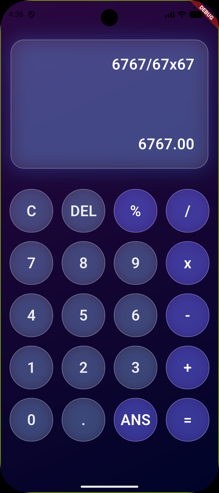

# SleekCalc: Modern Flutter Calculator

## Project Description

**SleekCalc** is a fully functional, beautifully designed calculator built using the Flutter framework. It features a modern, dark-themed UI with fluid interactions and large, easy-to-press buttons, matching the aesthetic of the provided screenshot.

This application is structured into two main components: the main screen (`homepage.dart`) and the reusable button logic/design (`buttons.dart`), making the code clean, modular, and easy to maintain.

## Features

* **Standard Arithmetic:** Supports addition (`+`), subtraction (`-`), multiplication (`x`), and division (`/`).
* **Clear & Delete:** Dedicated buttons for clearing the display (`C`) and deleting the last input (`DEL`).
* **Percentage Function:** Calculate percentages (`%`).
* **Decimal Support:** Includes a decimal point button (`.`).
* **Answer Recall:** An `ANS` button for recalling the last computed result.
* **Responsive UI:** Designed to look great on various mobile screen sizes.
* **Modern Aesthetic:** Utilizes a dark color palette with a glowing, smooth gradient effect on the display and rounded corners on all interactive elements.




## 📁 Project Structure

The application is cleanly separated into three primary files:

| File Name | Description |
| :--- | :--- |
| `main.dart` | The application entry point. Initializes the Flutter app and sets up the overall dark theme. |
| `homepage.dart` | The main UI of the calculator. This file handles the layout (display, button grid), state management, and the core calculation logic. |
| `buttons.dart` | Contains the custom `CalculatorButton` widget, which handles the stylized, rounded appearance and local tap events for individual keys. |

##  Technology Stack

* **Framework:** Flutter
* **Language:** Dart
* **External Package:** `math_expressions` (for handling complex mathematical string evaluation)

##  Getting Started

### Prerequisites

To run this project, you need to have Flutter installed on your machine.

* [Flutter SDK](https://flutter.dev/docs/get-started/install)

### Installation

1.  **Clone the repository:**
    ```bash
    git clone [https://github.com/your-username/sleekcalc.git](https://github.com/your-username/sleekcalc.git)
    cd sleekcalc
    ```
2.  **Install dependencies:** This will fetch the necessary packages, including `math_expressions`.
    ```bash
    flutter pub get
    ```
3.  **Run the app:**
    ```bash
    flutter run
    ```

The app will launch on your connected device or emulator.